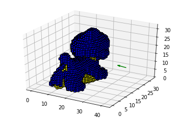

# NBV-Net:  A 3D Convolutional Neural Network for Predicting the Next-Best-View

This is a *PyTorch* implementation of the network (NBV-net) proposed by Mendoza for next best view planning. NBV-net determines the view that increases the reconstruction of a given object. It receives as input a 3D probabilistic grid of size 32x32x32, then it outputs the best view from a predefined view sphere. I am including the training notebook as well as several examples of the inference pass.

To make an "out of the box" prediction using your own data please open the "nbv_inference" notebook.

Thank you for visiting our site and please cite our work if you are using this network in an academic work.

Medoza's master thesis is:

> Miguel Mendoza, NBV-Net: una red neuronal convolucional 3D para predecir la siguiente mejor vista. Tesis de Maestría, Instituto Politécnico Nacional, 2018. 

The research paper has been published in Pattern Recognition Letters:

> Mendoza, M., Vasquez-Gomez, J. I., Taud, H., Sucar, L. E., & Reta, C. (2020). Supervised learning of the next-best-view for 3d object reconstruction. Pattern Recognition Letters.

Our preprint is available at arXiv:1905.05833.

This implementation uses the [nbv dataset](https://www.kaggle.com/irvingvasquez/nbv-classification) available at kaggle. Some examples of the dataset are:

Juan Irving Vasquez-Gomez  
[jivg.org](jivg.org)
Consejo Nacional de Ciencia y Tecnología
